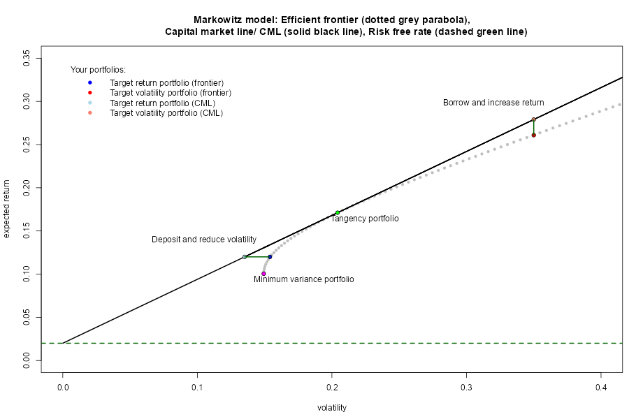
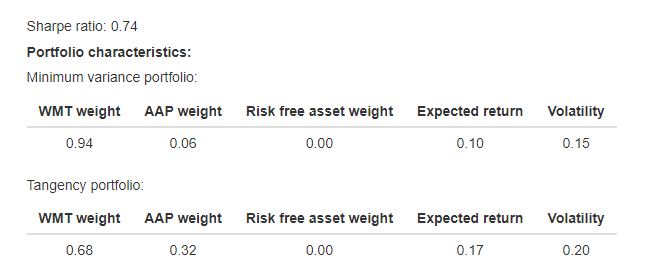

```{r setup, include=FALSE}
knitr::opts_chunk$set(echo = FALSE)
```

## Markowitz Portfolio Optimisation Demo App

**Ever wondered what Markowitz portfolio theory was all about?** 

This app will show you the basics from a very practical angle:

https://thinkerspark.shinyapps.io/markowitzdemoapp/

If you would like to read the theory, here are some useful links - please feel to experiment with the app while you are reading:

1. Markowitz model on Wikipedia: https://en.wikipedia.org/wiki/Markowitz_model
2. A good illustrative guide: https://www.wallstreetmojo.com/markowitz-model/
3. A deep dive into the maths, in a multi-stock setting: https://sites.math.washington.edu/~burke/crs/408/fin-proj/mark1.pdf

**Why Markowitz?**

Investing money has never been easier. Fintech made it more accessible and more affordable: Hello robo-advisors and fractionalised portfolios! Market information is mainstream: Inflation reports, central banks hiking or cutting rates - all over the papers. Stocks markets rallying or dipping: Did they finally create a sentient AI - big tech today; Will brain chip implants cure neurological conditions - biotech tomorrow; Will there be another war - defense sector the next day. 

But in the end, it is all about risk and return, so why not just look at the basics before diving in.

## An example with two stocks

The Markowitz demo app uses historical information of just two stocks (chart below): 

- Walmart - a stock with lower annual return and lower volatility (i.e. lower risk), and 
- Apple - a stock with higher annual return and higher volatility (i.e. higher risk). 

As an input, the app asks the user to provide three parameters, with default values (screenshot below): 
 (1) Risk free rate, (2) Target return, and (3) Target volatility.

```{r eqplot, echo=FALSE, fig.width = c(4,8), fig.height=6, fig.show="hold", fig.align="centre"}
knitr::include_graphics(c("Images/ParamsSelect.png", "Images/StockChart.png"))
```

Imagine this is all the market out there, plus a bank account where you can deposit or borrow cash at the risk free rate. Sure - in practice there are thousands of listed stocks, indices, ETFs etc., and the lending and borrowing rates are hardly ever the same. This is why it is just a demo - to show the basics, with simple assumptions.

**What happens when you press the "Submit" button?**
 
## The output plot: Efficient frontier & CML line

One of the outputs is a plot - it shows what is called Markowitz efficient frontier, as well as the Capital Market Line (CML). 

- The efficient frontier displays returns and volatilities of efficient portfolios - i.e. those with a minimum volatility at a given target return level, and a maximum return at a given target volatility level. Markowitz theory assumes that this is what a rational investor would want.

- The CML line illustrates achievable returns and volatilities if the risk free asset enters into the mix - with a guaranteed (small) return, and no volatility. This changes things - what the investor becomes interested in, is the return above the risk free rate vs. volatility.

- Various target portfolios (combinations of expected return and volatility), are highlighted on the output frontier/ CML plot:

```{r frontier, echo=FALSE, out.width = "80%", out.height="60%", fig.show="hold", fig.align="centre"}

```

## The output table: Different portfolios

The other output is a table including the characteristics of different portfolios - their asset weights, expected returns and volatilities. 

- First note the Sharpe ratio: The optimal return above risk rate per additional unit of volatility. This is the slope of the CML line.

- Minimum variance portfolio is a stock portfolio with minimum volatility. The lower volatility stock weight does not have to be 100% - there is a correlation effectbetween stocks!

- Tangency portfolio is the one with maximum (optimal) expected return above risk free rate per unit of volatility. This is how Sharpe ratio is calculated.

- Target portfolios on the frontier are those, where no borrowing/ lending comes into the mix.

- While target portfolios on the CML line include potential borrowing/ lending to achieve optimal expected return/ volatility.

Play around with the inputs. The app shows how portfolio weights get shifted between the stocks and the risk free asset  (negative weight means borrowing). I did not see a demo of this part before, and thought it may be practical to see.
Enjoy!

```{r portfolios, echo=FALSE, out.width = "60%", out.height="80%", fig.show="hold", fig.align="centre"}

```


